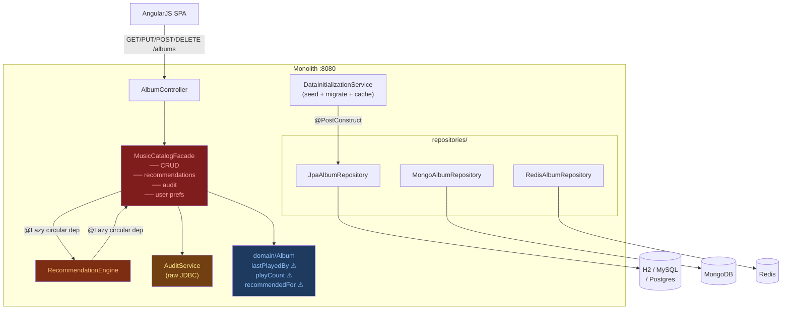
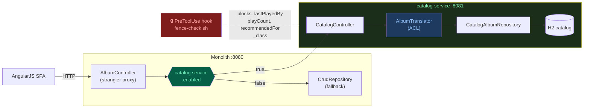

# ADR-001: Decomposition Strategy for spring-music

## Status
Proposed

## Date
2026-04-24

## Context

spring-music is a Spring Boot monolith serving a single REST resource (`/albums`) backed by a swappable persistence layer. The app works, but the CLAUDE.md at `src/main/java/org/cloudfoundry/samples/music/` documents the technical debt that makes continued development increasingly expensive:

- `service/MusicCatalogFacade` is a god class combining CRUD, recommendations, audit, and user-preference logic in one unit. Any change to album retrieval risks touching recommendation logic, and vice versa.
- `service/RecommendationEngine` carries a `@Lazy` circular dependency back into `MusicCatalogFacade`. This is not a design smell — it is a load-bearing coupling that makes either class difficult to test in isolation.
- `domain/Album` carries user-tracking fields (`lastPlayedBy`, `playCount`, `recommendedFor`) that belong to a different bounded context. These fields are already banned from crossing the future service boundary (see service boundary rules in `CLAUDE.md`).
- `service/AuditService` triggers raw JDBC on every save. Extracting it requires event infrastructure that is not yet in place.
- `config/DataInitializationService` conflates seed data loading, schema migration, and cache warming in one `@PostConstruct`. Any split must decide which service owns the seed data and which owns the schema.
- There is exactly one test (`ApplicationTests.java`) — a context load check. There are no unit tests and no integration tests against the HTTP layer. Any extraction that breaks behaviour will not be caught by the test suite in its current state.

The concrete friction: the team cannot confidently change `Album` field names, persistence configuration, or CRUD logic without risking regressions in recommendation and audit paths, because those paths share the same class and the same transaction boundary.

### Current state

## Decision

Extract three services in the following order, one at a time, with characterization tests pinned before each cut:

1. **Album Catalog Service** (`org.cloudfoundry.catalog`) — owns `/albums` CRUD, `Album` (fields: `id`, `title`, `artist`, `releaseYear`, `genre`, `trackCount`, `albumId`), and the `albums.json` seed data. This is the strangler target: `AlbumController` gains a `catalog.service.enabled` flag and proxies to the new service via `RestTemplate` when enabled. The monolith continues to serve traffic until the flag is flipped.
2. **User Preference Service** — owns `lastPlayedBy`, `playCount`, and `recommendedFor`. These fields are stripped from `Album` in the monolith and moved to a new entity in this service. Coupling is introduced only at the API boundary; the monolith never calls this service directly in the read path.
3. **Recommendation Engine Service** — owns `RecommendationEngine` logic. Extracted last because of the circular dependency into `MusicCatalogFacade` and the absence of tests. Cannot be extracted until the facade is broken apart and both ends have characterization coverage.

The strangler proxy in `AlbumController` is the integration mechanism. The `catalog.service.enabled` flag defaults to `false`; the monolith remains the source of truth until explicitly switched.

### Target state (Phase 4+)

## Seams

**Seam 1 — `AlbumController` → `CrudRepository<Album, String>`**
Location: `web/AlbumController.java`. The controller depends on the `CrudRepository` interface, not any concrete implementation. This is the cleanest seam in the codebase — swapping the repository for a `RestTemplate` call requires changing one constructor argument and five method bodies. No other class in the monolith calls `AlbumController`. This is a clean cut.

**Seam 2 — `AlbumRepositoryPopulator` → `CrudRepository` (via `BeanFactoryUtils`)**
Location: `repositories/AlbumRepositoryPopulator.java`. The populator resolves the repository from the application context at runtime, not via injection. When the catalog service is extracted, this populator moves with it — but its current implementation will break if the context no longer contains a local `CrudRepository`. This is a tangle: the populator must be rewritten or removed before the flag is flipped.

**Seam 3 — `SpringApplicationContextInitializer` → profile/auto-config exclusion**
Location: `config/SpringApplicationContextInitializer.java`. This class owns which persistence backend is active and which Spring auto-configurations are excluded. It is self-contained (no callers outside of Spring's bootstrap mechanism) but couples the monolith startup to knowledge of all five backend types. When the catalog service is extracted, this initializer travels with the catalog service and the monolith no longer needs it. Clean cut once the catalog service is separate.

**Seam 4 — `Album.domain` user-tracking fields → future User Preference Service**
Location: `domain/Album.java`. Fields `lastPlayedBy`, `playCount`, `recommendedFor` exist in the domain model description but are not yet in the `Album.java` entity. When added (as the tech debt implies they will be), they share the same JPA table as catalog fields. This is a data-model tangle: splitting them requires a schema migration and a decision about which service owns the `album` table row.

**Seam 5 — `RecommendationEngine` ↔ `MusicCatalogFacade` circular dependency**
Location: `service/` (not yet extracted from the monolith). The `@Lazy` annotation is a code smell marking an unresolved design decision. Neither class can be instantiated independently for testing. This is a tangle, not a seam.

## Service Candidates — Ranked by Extraction Risk

| Rank | Service | Boundary | Coupling Score (0–3) | Data-Model Tangle (0–3) | Test Coverage (0–3 inv.) | Business Criticality (H/M/L) | Overall Extraction Risk |
|------|---------|----------|----------------------|------------------------|--------------------------|------------------------------|------------------------|
| 1 | Album Catalog Service | `AlbumController` ↔ `CrudRepository<Album,String>` | 1 | 1 | 3 | H | Low |
| 2 | User Preference Service | `Album` user-tracking fields ↔ new entity | 1 | 2 | 3 | M | Medium |
| 3 | Recommendation Engine Service | `RecommendationEngine` ↔ `MusicCatalogFacade` | 3 | 2 | 3 | M | High |

**Coupling score rationale:**
- Catalog: `AlbumController` is called by no other class; `CrudRepository` interface means zero concrete coupling to the backend. Score: 1.
- User Preference: new entity with no existing callers, but must share or fork the `Album` table. Score: 1.
- Recommendation: circular `@Lazy` dependency into the facade; cannot isolate without breaking both. Score: 3.

**Data-model tangle rationale:**
- Catalog: `Album` table owns catalog fields cleanly. The `_class` field in `albums.json` leaks the monolith package name but is ignored by Jackson (`FAIL_ON_UNKNOWN_PROPERTIES=false`). Score: 1.
- User Preference: shares the `Album` row with catalog fields in the JPA backend; Redis backend serialises the whole `Album` hash. Either way, a migration is required. Score: 2.
- Recommendation: depends on whatever data model the facade uses; no clean table boundary. Score: 2.

**Test coverage (inverted — higher = more risk):** The entire codebase has one context load test and zero characterization tests. Every service scores 3 (maximum risk). This is the primary argument for running the Tester-Pin agent before any cut.

## What We Chose Not To Do

**Did not split by database backend type.** The multi-backend capability (`jpa/`, `mongodb/`, `redis/` repositories) is a deployment concern, not a domain boundary. Splitting into a "JPA service" and a "Redis service" would duplicate the `Album` domain model across three deployables with no business logic separation. The profile-switching mechanism in `SpringApplicationContextInitializer` is already an adequate abstraction; it travels with the catalog service.

**Did not extract `AuditService` immediately.** `AuditService` fires raw JDBC on every save. Extracting it correctly requires an event bus so the catalog service can publish save events without coupling back to the audit implementation. No event infrastructure exists in the current stack. Extracting audit now would require either a synchronous HTTP callback (negating the decoupling benefit) or introducing Kafka/RabbitMQ as a dependency before any other service is stable. This risk is not warranted until Phase 4.

**Did not attempt to split `MusicCatalogFacade` in one step.** The facade is a god class with four distinct responsibilities. A single-step split would require simultaneous changes to domain model, persistence, API contract, and test harness with zero existing test coverage as a safety net. The risk of a silent regression is unacceptable. The characterization suite (Tester-Pin agent) must be green before the facade is touched, and then it must be split incrementally — one responsibility per commit.

**Did not extract the AngularJS frontend as a separate deployable.** The frontend is a static SPA bundled into the JAR with no build step. It calls `/albums` and `/appinfo`. Extracting it would require a CDN or separate web server, CORS configuration, and changes to how `InfoController` exposes profile data — all for zero domain boundary benefit. The frontend has no logic that belongs in a separate bounded context.

**Did not use the `InfoController`/`AppInfo` path as an extraction seam.** `InfoController` exposes CF environment metadata (`/appinfo`, `/service`) for operational visibility. It has no domain logic and no callers outside the browser UI. Extracting it would create a deployable whose sole purpose is proxying CF environment variables — a deployment concern, not a service boundary.

## CLAUDE.md Structure Recommendation

**Why three levels:** The three-level hierarchy (user / project / directory) maps to three different audiences with different update frequencies. User-level preferences (terse style, conventional commits) apply to every project the developer touches and should not be repeated or overridden per-project. Project-level guidance applies to every contributor on spring-music regardless of which package they are in. Directory-level guidance is scoped to the extraction phase and becomes wrong the moment the directory is promoted to its own repository.

**What belongs at project level (`spring-music/CLAUDE.md`) and why it would be missed if absent:**
- Build commands (`./gradlew clean assemble`, profile flags) — without these, a new contributor will spend 20 minutes finding the right JAR name and profile syntax
- The agent invocation order (pm-stories → architect-map → tester-pin → agentic-scouts → dev-cut → dev-fence) — this is the workshop's critical path; violating the order (e.g., running dev-cut before tester-pin) produces undetected regressions
- Test tag conventions (`@Tag("characterization")` must never be deleted) — this is a project-wide invariant enforced by human review, not by the build
- Service boundary rules (monolith must never import from `org.cloudfoundry.catalog.*`; banned field names) — these rules apply to any file in the project, not just files in the extracted service

**What must move to directory level once extraction begins:**
- The monolith root `src/.../music/CLAUDE.md`: "you are in the extraction source — prefer extracting over adding" guidance. This only makes sense while the monolith exists as a source of truth; it would be misleading in a clean catalog-service repository.
- `new-service/CLAUDE.md`: banned API field names, package import restrictions. These are scoped to the extracted service's conventions and would pollute the monolith root CLAUDE.md with rules that do not apply there.

**Hooks vs. prompts — why the fence is a hard block:** Directory-level CLAUDE.md instructions for the monolith root say "prefer extraction over addition." This is preference guidance with legitimate exceptions: a bug fix in the monolith while extraction is in progress is a valid reason to add to the monolith temporarily. Prompt instructions can be reasoned around and they should be, when the exception is legitimate. The PreToolUse fence hook (`.claude/hooks/fence-check.sh`, active from Phase 5) is different in kind: it exits 1 if any Edit or Write would place a monolith-internal field name (`lastPlayedBy`, `playCount`, `recommendedFor`, `_class`) into `catalog-service/`. This is not a preference — it is a correctness constraint. A model that "reasons around" this constraint produces an API that leaks monolith internals to consumers permanently. Hard blocks are appropriate when the cost of a false positive (blocking a legitimate edit) is lower than the cost of a false negative (shipping a leaking field name into the catalog API). The fence hook represents that judgment. See `docs/adr/002-fence-strategy.md` for the full rationale and the list of banned identifiers.

## Consequences

### Positive
- `AlbumController` can be deployed and scaled independently once the strangler proxy is active, with no changes to the AngularJS frontend
- The `catalog.service.enabled` flag enables a zero-downtime cutover: flip to `true`, verify, flip back if needed
- Removing user-tracking fields from `Album` shrinks the catalog service's data model to five fields, making the API contract explicit and stable
- Characterization tests pinned before each cut give the team a regression baseline that currently does not exist

### Negative / Trade-offs
- The strangler proxy in `AlbumController` adds a network hop for every read and write during the transition period. Latency will increase until the monolith is decommissioned.
- `AlbumRepositoryPopulator` must be rewritten before the flag is flipped. It currently resolves the repository from the Spring context by type — a technique that does not survive the catalog service moving out of the monolith's application context.
- Two deployables must be kept green simultaneously during extraction. The team's CI pipeline must run both the `@Tag("characterization")` suite and the `@Tag("contract")` suite on every commit that touches extraction code.

### Risks
- **The only existing test is a context load check.** If the characterization suite (Tester-Pin agent) is not run before dev-cut begins, there is no safety net. Mitigation: gate dev-cut on Tester-Pin completion in `PLAN.md`.
- **`albums.json` embeds `_class: "org.cloudfoundry.samples.music.domain.Album"`.** When the catalog service deserialises this file, the `_class` field must be ignored (Jackson's `FAIL_ON_UNKNOWN_PROPERTIES=false` already handles this, but the field must not appear in the catalog service's outbound API). Mitigation: fence hook blocks `_class` from appearing in `catalog-service/` API layer files.
- **The multi-backend persistence model assumes a single active profile.** If Cloud Foundry auto-detects two bound services, `SpringApplicationContextInitializer` throws. This constraint travels with the catalog service; the extracted service must preserve the one-profile validation or the error surface grows. Mitigation: include this constraint in the `@Tag("characterization")` suite.

## Review Trigger

Revisit this ADR when the first service (Album Catalog Service) is successfully extracted and the strangler proxy has served production traffic for one week, or when the team size exceeds six engineers working on the extraction simultaneously — whichever comes first. At that point the sequencing of User Preference Service extraction should be re-evaluated against the actual coupling discovered during the catalog cut.
